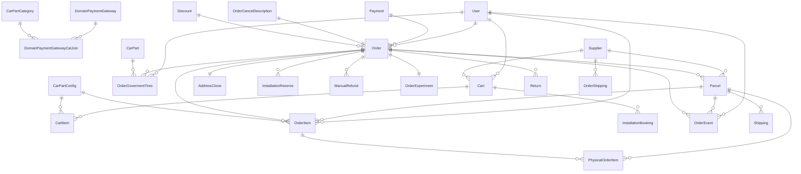

# Order Module — ERD

تولیدشده از روی دکوریتورهای TypeORM در `src/order/entities/` (به‌روز با کد فعلی).

**موجودیت‌های خارج از این ریپو** (فقط به‌عنوان مرجع در نمودار آمده‌اند): `AddressClone`، `CarPartCategory`، `CarPartConfig`، `CarPart`، `Discount`، `DomainPaymentGateway`، `InstallationBooking`، `InstallationReserve`، `Payment`، `PhysicalOrderItem`، `Return`، `Shipping`، `Supplier`، `User`
